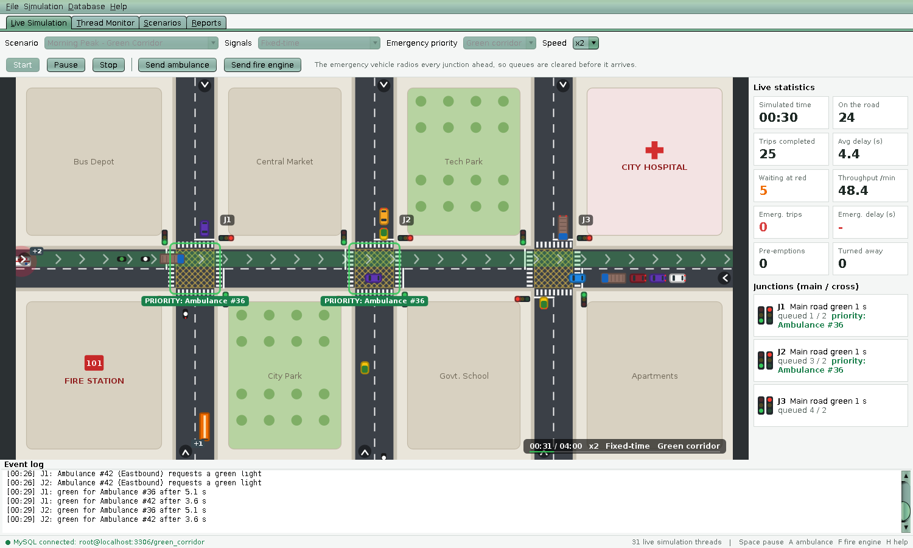
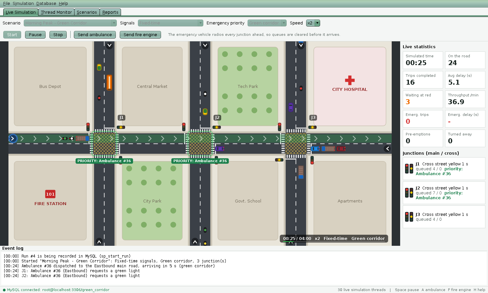
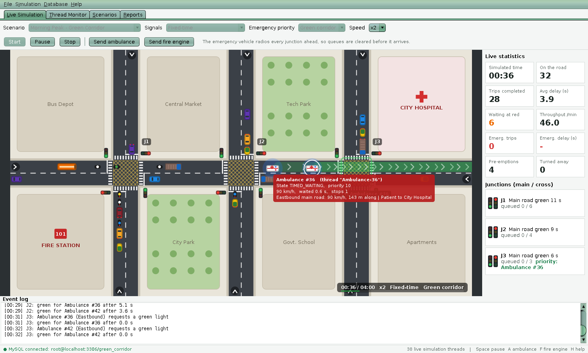
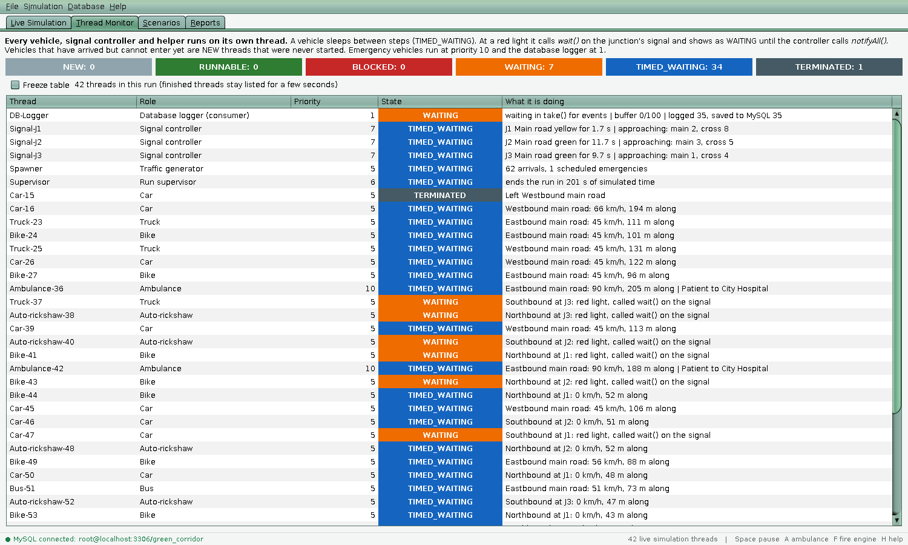
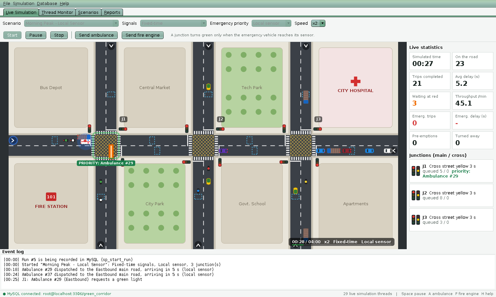
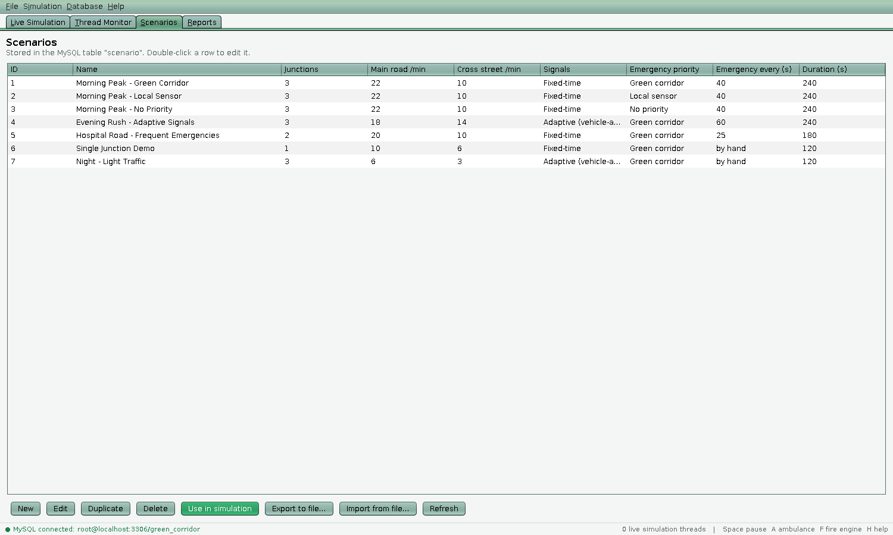
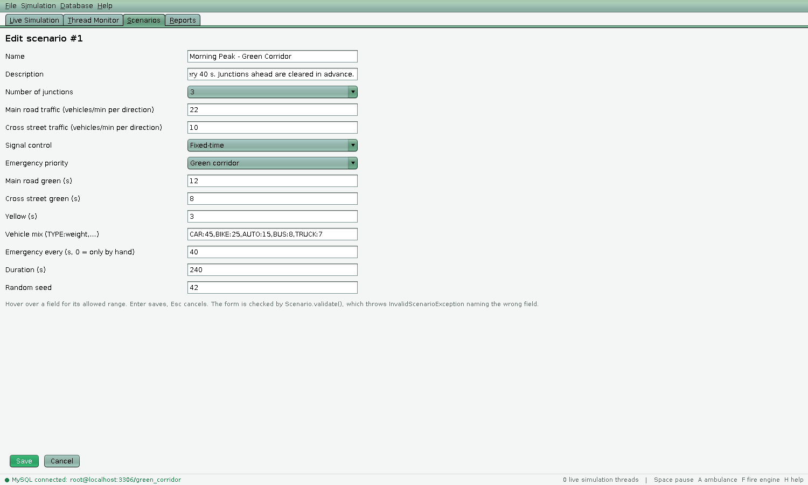
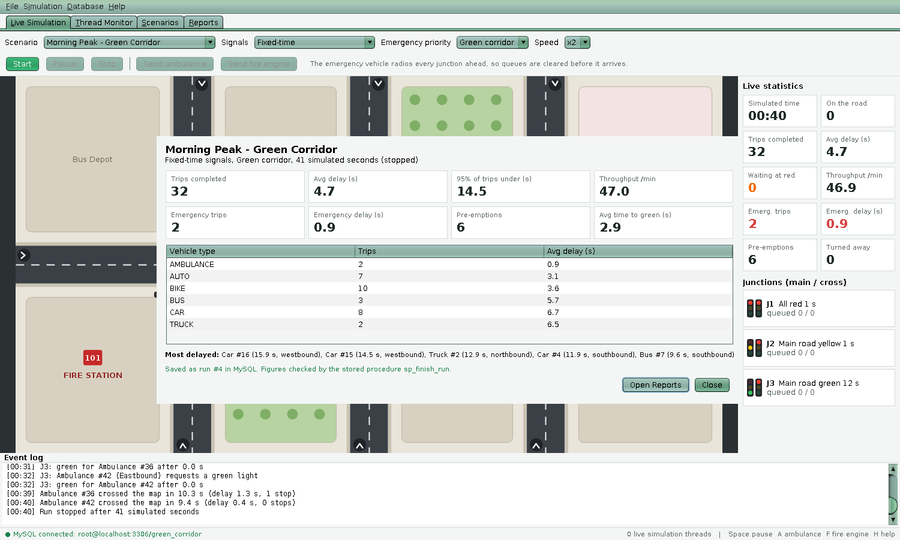
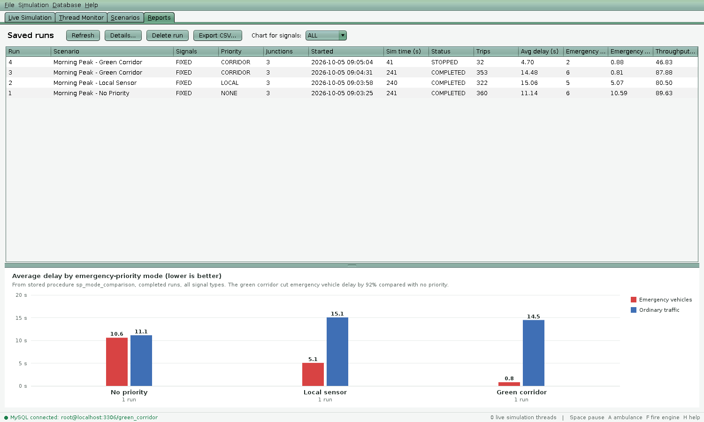

# GreenCorridor: Smart Traffic Junction Simulator with an Emergency Vehicle Green Corridor

**Course:** Object Oriented Programming through Java (VCE-R25, B.Tech CSE). Course End Project, Batch No. 6.

| Roll No.   | Name                 |
|------------|----------------------|
| 25881A05V7 | Madhavarapu Saritha  |
| 25881A05X9 | Chepyala Vishal      |
| 25881A05X0 | Gundu Srijay Krishna |



## Problem statement

In Indian cities, ambulances lose minutes waiting at red lights and behind queues of vehicles
that have nowhere to go. A "green corridor" (every signal on the ambulance's route turned
green before it arrives) is set up today only for organ transport, by police
standing at each junction.

**GreenCorridor** is a Java desktop application that simulates a busy road with up to three
signalled junctions. Every vehicle is its own thread. It compares three ways of handling
emergency vehicles on the same traffic:

1. **No priority:** ambulances wait at red lights like everyone else.
2. **Local sensor:** a junction turns green when the ambulance reaches a detector just
   before it (how most "smart" signals work today).
3. **Green corridor:** the ambulance's route is radioed to every junction ahead when it is
   dispatched, so the queues are cleared before it gets there.

Every run is stored in MySQL. A report compares the modes: how much faster the
ambulance gets through, and what it costs the rest of the traffic.

### Objectives

- Model vehicles, junctions and signals as objects, and run each one on its own thread.
- Make hundreds of vehicle threads share roads and junctions safely: no two vehicles in the
  same place, and crossing traffic never inside a junction together.
- Implement fixed-time and vehicle-actuated (adaptive) signal control, plus emergency
  pre-emption.
- Store scenarios, runs, trips and pre-emption events in MySQL through JDBC, with full CRUD
  from a Swing GUI.
- Measure and compare emergency-vehicle delay and ordinary-traffic delay for each mode.

## What the application does

| Tab | What you see and do |
|-----|---------------------|
| **Live Simulation** | The map, animated about 30 times a second. Start, pause and stop a run, or change the speed (x1 to x8). Send ambulances and fire engines. Hover a vehicle to see its thread, state and priority. Click a junction to end its green early (traffic police override). Click a road entry to send an ambulance there. Live statistics and an event log. |
| **Thread Monitor** | Every thread of the run with its life-cycle state (NEW, RUNNABLE, BLOCKED, WAITING, TIMED_WAITING, TERMINATED), priority and current activity, refreshed twice a second. |
| **Scenarios** | Create, edit, duplicate and delete scenarios (stored in MySQL). Export or import a scenario as a file (serialization). |
| **Reports** | Every stored run, a chart comparing the three priority modes (from a stored procedure), per-run details and CSV export. |

How the traffic behaves:

- Traffic keeps to the left. Vehicles keep a safe gap, react about 0.45 s after the way clears,
  and brake smoothly.
- There are five ordinary vehicle types: car, bike, auto-rickshaw, bus and truck. The two
  emergency types are the ambulance and the fire engine.
- **Junction box:** a vehicle crosses only if there is room for it beyond the junction, so
  queues never block the crossing street. The box itself is a `synchronized` critical
  section: crossing traffic can never be inside it at the same time.
- **Pulling over:** ordinary vehicles move to the left edge when a siren comes up behind
  them, and the emergency vehicle overtakes them.
- **Signals:** fixed-time signals give each road a set green time. Adaptive signals end a
  green early when the road is empty, and keep it while vehicles keep coming.

## Results

These come from the headless benchmark (`Experiment` in the tests). Each figure is the average
of 5 runs of the "Morning Peak" scenario: 240 simulated seconds, 3 junctions, about 370
vehicles and 4 to 6 emergencies per run. Delay means extra time compared with driving across
an empty road.

| Priority mode | Emergency vehicle delay (range over 5 runs) | Ordinary traffic: average delay | Ordinary traffic: 95% of trips under | Trips per run |
|---------------|---------------------------------------------|---------------------------------|--------------------------------------|---------------|
| No priority   | 6.1 s (5.8 to 6.5)                          | 12.2 s                          | 26.1 s                               | 381           |
| Local sensor  | 4.2 s (3.0 to 5.6), **32% less**            | 14.4 s                          | 43.1 s                               | 356           |
| Green corridor| **1.3 s** (1.0 to 1.8), **79% less**        | 14.1 s                          | 35.3 s                               | 368           |

All 15 runs, and 6 more on the "Hospital Road" scenario (an emergency every 25 s), ended with
**zero** overlapping vehicles, **zero** junction-box conflicts and **zero** stalls. A safety
checker thread verified this every 20 ms.

What the numbers show:

- The **green corridor** almost removes emergency delay. Junctions are told when the vehicle
  is dispatched, so a light change (3 s yellow plus 2 s all-red) is finished before it arrives.
- The **local sensor** helps much less. The ambulance often waits at the stop line while the
  light changes, and the cross street's green is cut at the last moment.
- Ordinary traffic pays for every pre-emption. This scenario is deliberately extreme (an
  emergency about every 40 s), and average delay still rose by only about 16% with the
  corridor and 18% with the local sensor. The corridor is the cheaper of the two, because it
  changes the lights early instead of abruptly: 95% of trips finish within 35 s against 43 s.
  With a realistic number of emergencies (a few per hour) the cost is spread over far more
  vehicles.
- Results vary from run to run because 40 to 60 threads are scheduled by the operating system.
  That is why every figure is an average of several runs.

Future work: use adaptive signals together with the corridor, coordinate the signal offsets
along the main road (a "green wave"), and model turning traffic.

## How the syllabus is used

| Unit | Topic | Where in the code |
|------|-------|-------------------|
| I | Classes, objects, encapsulation | `model.Scenario` and `model.TripRecord`: private fields, getters and setters |
| I | Constructors and overloading | `Scenario()` and `Scenario(String)`; `Database.getConnection()` and `getConnection(DbConfig)`; `StatTile.setValue(String)` and `setValue(String, Color)` |
| I | `this`, `static`, arrays | `Vehicle.counter`, `nextNumber()` and `resetNumbering()`; `int[] boxOccupancy` in `Junction`; `SimulationEngine.this.stop()` |
| I | Inheritance (multilevel), `super` | `Vehicle` → `EmergencyVehicle` → `Ambulance`; `super(26, 13, 110, 75)` in `Car`; exception hierarchy |
| I | Overriding, dynamic method dispatch | `drawBody()` in every vehicle; `v.draw(g, t)` in `SimulationCanvas.paintVehicles`; `ScenarioRepository` points to the MySQL or in-memory class at run time |
| I | Abstract classes, `final` | `Vehicle`, `EmergencyVehicle` and `SimEvent` are abstract; `final class Ambulance`; `final void run()`; constants in `SimConfig` |
| I | Interfaces, extending interfaces | `Drawable`, `Prioritized`, `Monitorable`, `EngineListener`; `EmergencyResponder extends Prioritized, Drawable` |
| I | Packages, access protection | `model`, `road`, `vehicle`, `engine`, `db`, `io`, `exception`, `ui`; package-private `SignalController.tick()` and `SimulationEngine.admit()`; protected hooks `beforeStep()` and `onLeaveJunction()` |
| II | try, catch, finally, throw, throws | `Vehicle.run()` (finally leaves the lane); `Scenario.validate() throws InvalidScenarioException`; try-with-resources around every JDBC object |
| II | Built-in exceptions | `InterruptedException`, `SQLException`, `SQLIntegrityConstraintViolationException`, `IOException`, `NumberFormatException`, `ClassNotFoundException`, `InvalidClassException` |
| II | Own exception subclasses | `SimulationException` → `InvalidScenarioException`, `RepositoryException` → `DatabaseUnavailableException`, `ScenarioFileException`; unchecked `IllegalSimulationStateException` |
| II | Thread life cycle | Thread Monitor tab: queued vehicles are NEW, moving ones TIMED_WAITING (sleep), ones at a red light WAITING (`wait()`), finished ones TERMINATED |
| II | Creating threads | `extends Thread`: `VehicleSpawner`, `DatabaseLogger`, `Supervisor`. `implements Runnable`: `Vehicle`, `SignalController` |
| II | Thread priorities | Emergency vehicles `MAX_PRIORITY` (10), signal controllers 7, database logger `MIN_PRIORITY` (1) |
| II | Synchronization | `synchronized` methods in `Lane`, `Junction.tryEnterBox()`, `StatsCollector`, `ThreadRegistry`; `synchronized` blocks in `SignalController` |
| II | Inter-thread communication | `wait()` and `notifyAll()` in `EventBuffer` (producer-consumer), `SignalController.awaitGreen()` and `setPhase()`, and the pause gate in `SimClock` |
| II | String, StringBuffer | `SqlScript` and `CsvExporter` build text with `StringBuffer`; `String.format` throughout |
| III | ArrayList, LinkedList | Lane queues and the event buffer are `LinkedList`s; pre-emption requests are kept ordered with a `ListIterator` |
| III | HashSet, TreeSet | Junctions an ambulance has called (`HashSet`); the five most delayed trips (`TreeSet` with a `Comparator`) |
| III | HashMap, TreeMap | `RoadNetwork.laneByKey`, form fields by name (`HashMap`); delay per vehicle type (`TreeMap`) |
| III | StringTokenizer, Arrays | `Scenario.parseVehicleMix()` splits `"CAR:45,BIKE:25"`; `Arrays.sort` for the 95th-percentile delay |
| III | File streams, FileReader and FileWriter | `ScenarioFiles` (`FileInputStream`, `FileOutputStream`); `DbConfig` and `RunLogWriter` (`FileReader`, `FileWriter`); `CsvExporter` |
| III | Serialization | `Scenario implements Serializable`; export and import as `.gcs` files, with a class allow-list on reading |
| IV | Delegation event model, adapters | `MouseAdapter` and `KeyAdapter` on the map, `WindowAdapter` on the frame, `ActionListener` on every button, `ChangeListener` on the tabs |
| IV | Mouse and keyboard events | Hover, click and Shift+click on the map; Space, Enter, Esc, A, F, 1-4 and H keys; menu accelerators F1 and F5 to F9 |
| IV | Layout managers | `BorderLayout` (frame), `FlowLayout` (toolbars), `GridLayout` (tiles and form), `CardLayout` (Scenarios list and form; Reports online and offline), `BoxLayout`, `GridBagLayout` |
| IV | Swing components | `JFrame`, `JPanel`, `JComponent` (the map), `JLabel`, `JTextField`, `JPasswordField`, `JTabbedPane`, `JButton`, `JCheckBox`, `JScrollPane`, `JComboBox`, `JTable`, `JSplitPane`, `JDialog`, `JFileChooser` |
| V | JDBC architecture, Type 4 driver | `Database` uses `DriverManager` with MySQL Connector/J (pure Java, Type 4) |
| V | Statement, PreparedStatement | `RunDao.listRuns()` (Statement); CRUD in `MySqlScenarioRepository` and batch inserts in `DatabaseLogger` (PreparedStatement) |
| V | CallableStatement | `sp_start_run` (OUT run id), `sp_finish_run` (three OUT values), `sp_mode_comparison` (returns a result set) |
| V | CRUD with a GUI | The Scenarios tab (create, read, update, delete); runs are created, listed and deleted from the Reports tab |
| V | Metadata, transactions | `DatabaseMetaData` (`SchemaInstaller`, connection test); `ResultSetMetaData` (column names in `RunDao`); `setAutoCommit(false)`, `commit()` and `rollback()` in the logger |

## Threads at a glance

```
 Swing event dispatch thread       paints the map 30x/s, buttons, tables
 │
 ├─ Supervisor        (extends Thread)   ends the run when time is up
 ├─ Spawner           (extends Thread)   random arrivals → creates vehicle threads (NEW)
 ├─ Signal-J1..J3     (Runnable, prio 7) light cycle + emergency pre-emption
 │        ▲ notifyAll() on every light change
 │        │ wait() at a red light
 ├─ Car-12, Bus-13 …  (Runnable, prio 5) one thread per vehicle
 ├─ Ambulance-14      (Runnable, prio 10) asks junctions for green, overtakes
 │        │ put(trip)                    producer
 │        ▼
 │   EventBuffer (bounded, wait/notifyAll)
 │        │ take()                       consumer
 └─ DB-Logger         (extends Thread, prio 1) batch INSERT into MySQL + log file
```

Deadlock was avoided by design and by testing:

- **Lock order:** lane methods never call into other locked objects, and the only nested
  locking (signal, then lane, in `awaitGreen`) always happens in the same order.
- **A logical deadlock the tests caught:** a bus had pulled over for an ambulance, but the
  auto-rickshaw behind it was inside a junction box and could not move aside. The fix was a
  rule that a vehicle pulls over only if every vehicle between it and the siren has done so
  too.
- **Starvation:** back-to-back emergencies could keep a cross street red for 40 s or more. Now a
  road that was held red for an emergency always gets at least its 4 s minimum green before
  the next emergency can take the junction.

## Database

Four tables: `scenario`, `simulation_run`, `vehicle_trip` and `preemption_event`.

Three stored procedures:

- `sp_start_run` creates the run row and returns its id.
- `sp_finish_run` computes the run's figures from its trips.
- `sp_mode_comparison` averages completed runs by priority mode.

The full script is [`app/src/main/resources/sql/green_corridor.sql`](app/src/main/resources/sql/green_corridor.sql).

## Running it

See [`app/README.md`](app/README.md). In short: install MySQL 8 and JDK 8 or newer, then run
`mvn package` and `java -jar target/GreenCorridor.jar`. The app asks to create its tables the
first time it connects.

## Screenshots

| | |
|---|---|
|  Normal traffic, fixed-time signals |  Hovering the ambulance shows its thread: priority 10 |
|  Thread Monitor: vehicles at red lights are WAITING |  Local-sensor mode, with the detector loops drawn on the road |
|  Scenario CRUD (MySQL) |  Scenario form, validated by `InvalidScenarioException` |
|  Run summary, checked by `sp_finish_run` |  Reports: comparison from `sp_mode_comparison` |
